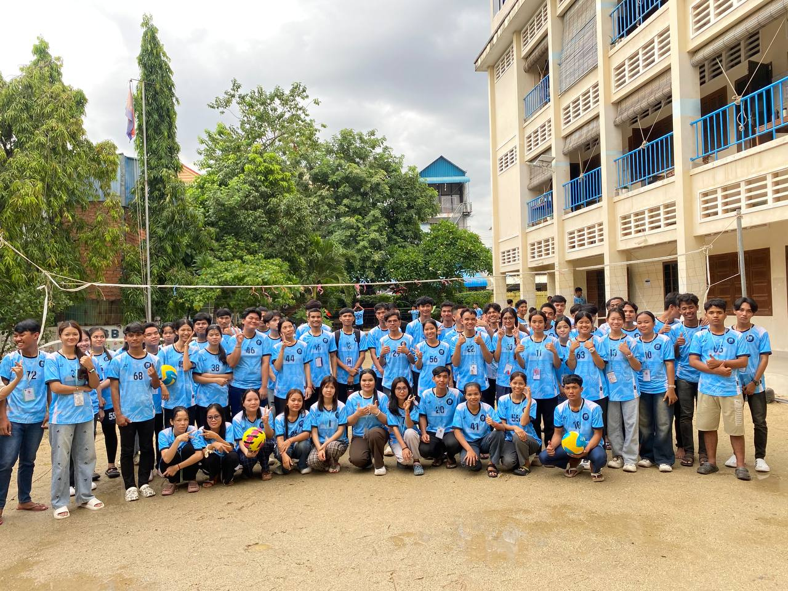

## 🏅​​​​​​​​​​ **PNC Sport Management System**

[](https://www.passerellesnumeriques.org/what-we-do/cambodia/)

PNC Sport Managment System, we focus to manage task metail of sport, such as football, volleyball, basketball, boxing, tannis, and batminton.

## 🔑 **PNC Core Value**
1. **Respect :** Treating others with dignity. Listening and considering different opinions. Valuing everyone's differences and contributions.
2. **Responsibility :** Being accountable for your actions. Doing your tasks seriously and on time. Taking ownership of your personal and academic growth.
3. **Solidarity :** Helping and supporting others. Working as a team. Being empathetic and sharing knowledge or time.
4. **Trust :** Believing in yourself and others. 
Being honest and reliable. Building strong relationships based on honesty and openness.

[](https://www.passerellesnumeriques.org/what-we-do/cambodia/)
[](https://www.passerellesnumeriques.org/what-we-do/cambodia/)
[](https://www.passerellesnumeriques.org/what-we-do/cambodia/)
[](https://www.passerellesnumeriques.org/what-we-do/cambodia/)

## **Type of Sports**
- [Football](#Football) 
- [Volleyball](#Volleyball)
- [Basketball](#Basketball)
- [Boxing](#Boxing)
- [Tannis](#Tannis)
- [Batminton](#Batminton)

## 🚀 **Installation**
Clone the project and install dependencies:

```bask
git clone https://github.com/your-username/pnc-sports-management-system.git
```
```bask
cd pnc-sports-management-system
```
```bask
npm install
```

## ⚽ **Football Team**


[](https://www.passerellesnumeriques.org/what-we-do/cambodia/)


## 🏐 **Volleyball**


[](https://www.passerellesnumeriques.org/what-we-do/cambodia/)

## 👉 List Membership
|ID | Name      | Position| 
|---|-----------|---------|
|12 | Bunna     | Foward  |
|11 | Rady      | Foward  |
|62 | Chamrearn | Middle  |
|30 | Vanda     | Foward  |
|12 | Sothin    | Diffent |
|67 | Sok An    | Diffent |
|61 | Rathana   | GK      |
<!-- |-------------------------| -->

## **Language Coding**
- [Python](#Python)
```python
print("Welcome to PNC Sports Management System")
```

- [HTML](#HTML)
```html
<h2>Welcome to PNC SPORTS</h2>
```
- [CSS](#CSS)
```css
background-color: blue;
```
- [JavaScript](#JavaScript)
- [PHP](#PHP)
- [OOP](#OOP)

## **🔧 Usage**
To run the server in development mode:
```bask
npm run dev
```
To start the server normally:
```bask
npm start
```
Access the API at
```bask
http://localhost:3000/api
```

## **🧪 Scripts**
```bask
npm start       # Start the server
npm run dev     # Start with nodemon
npm test        # Run test cases
```


